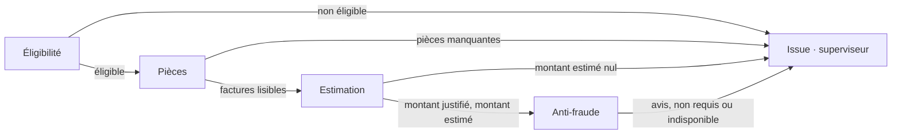

# 1 · Carte des agents

[← Sommaire](README.md)

## Les cinq agents

Chaque agent répond à une seule question, ne lit que sa **vue** (moindre privilège) et produit une seule section métier. Le superviseur l'enregistre ensuite en citant l'agent comme auteur.

| Agent | Question | Lit (sa vue) | Section produite | Ne fait jamais |
|---|---|---|---|---|
| **Éligibilité** | Le contrat couvre-t-il ce sinistre ? (conditions 1 à 5 du [§4](../specs_metier.md#L71-L82)) | Contrat (statut, cotisations, formule, date de souscription), type et dates du sinistre | `eligibilite` | Chiffrer, appliquer le plafond |
| **Pièces** | Les pièces exigées sont-elles présentes et lisibles ? ([§5](../specs_metier.md#L91-L108)) | Type de sinistre, pièces jointes, dépôts déjà lus dans l'espace assuré | `pieces` | Chiffrer, juger la fraude |
| **Estimation** | Combien l'assureur rembourse-t-il ? ([§6](../specs_metier.md#L110-L118) + plafond du [§4](../specs_metier.md#L84-L86)) | Montant déclaré, factures lisibles, franchise et plafond de la formule | `estimation` | Juger la fraude |
| **Anti-fraude** | Faut-il consulter le partenaire, et que dit-il ? ([§7](../specs_metier.md#L120-L145)) | Les 7 champs du contrat, plus le montant justifié (pour F4) | `avis_fraude` | Émettre un avis, recopier une réponse non conforme, relancer |
| **Superviseur-décideur** | Qui agit ensuite, et quelle issue ? ([§10](../specs_metier.md#L180-L194)) | Tout l'état, **sauf la réponse brute du partenaire** | `issue` | Refaire le travail d'un agent, modifier une valeur (sa revue de fond ne fait que signaler, livrable 2) |

**Limite assumée :** la spec demande aussi des pièces « cohérentes avec la déclaration » ([§5, L100-101](../specs_metier.md#L100-L101)). Aucune règle dédiée ne le vérifie. L'écart de montant entre déclaré et justifié est couvert par F4 ; le reste est un usage envisagé, non implémenté, au livrable 6.

Le partenaire anti-fraude reste **hors de l'équipe**. On ne maîtrise que ce qu'on lui envoie et ce qu'on accepte de sa réponse (livrable 3).

## Les frontières tranchées

| Frontière | Décision | Preuve |
|---|---|---|
| **Le plafond de garantie (point ambigu)** | La règle est rangée dans l'Éligibilité ([§4, L84-86](../specs_metier.md#L84-L86)) mais porte sur un **montant**. C'est donc l'**Estimation** qui l'applique : montant estimé = min(montant retenu − franchise, plafond). Elle signale `plafond_applique`, et le motif rappelle la règle. | NOM-05 : 4 200 € déclarés, franchise de 300 €, plafond de 3 000 € → **acceptée, 3 000 €**. Le code fourni refusait la demande. |
| **Les indicateurs F1 à F4** | Ils sont calculés par l'**Anti-fraude** : ils décident s'il faut consulter le partenaire, sans juger la fraude. L'Estimation n'y touche pas. | E2 : « l'estimation ne juge pas la fraude » |
| **Le routage vers une file humaine** | Il fait partie de `issue`, donc il revient au **superviseur-décideur** seul. | [§11](../specs_metier.md#L196-L209) : `file` est un champ de la fiche |
| **La demande de complément** | L'agent Pièces **la demande** (statut `complement_requis`) ; le superviseur **l'exécute** en lisant le dépôt suivant. | Aucun agent n'écrit hors de sa section |

## Dépendances et parallélisme

- **À l'intérieur d'une demande, les agents passent l'un après l'autre.** Éligibilité et Pièces pourraient tourner en parallèle, mais l'ordre séquentiel permet de s'arrêter dès qu'une demande est non éligible : on évite alors la boucle de compléments et l'appel au partenaire. Le gain du parallélisme serait de quelques millisecondes, puisque ces agents appliquent des règles.
- **Entre les demandes d'un lot, le traitement est parallèle**, 8 demandes au plus en même temps ([__init__.py:15](../../src/kaldera/__init__.py#L15)). Chaque demande a son propre budget de temps et n'attend jamais les autres ([§12, L217](../specs_metier.md#L217)).
