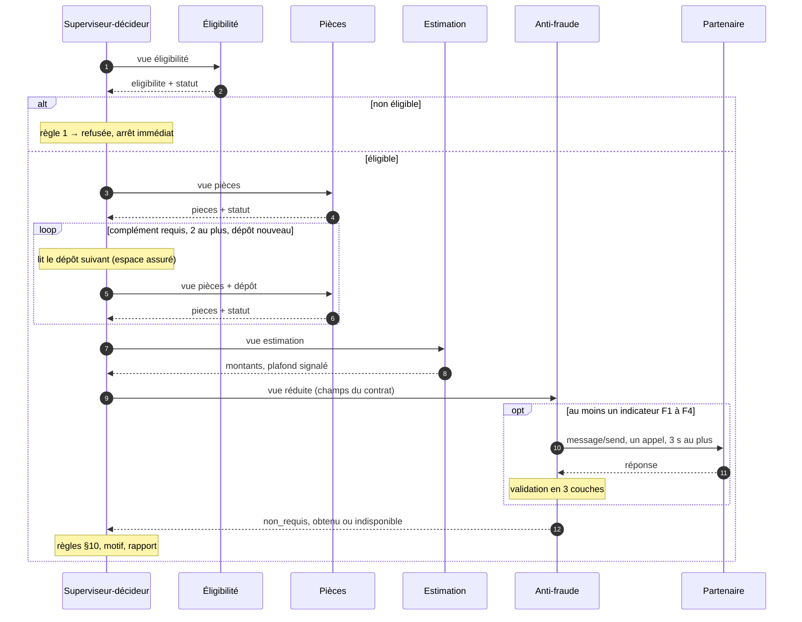

# 2 · Orchestration et mémoire partagée

[← Sommaire](README.md)

## Déroulé d'une demande

Le superviseur-décideur suit un **ordre fixe**, écrit dans le code. Les règles de décision du [§10](../specs_metier.md#L180-L194) sont du code déterministe, appelé comme un outil.



## Conditions d'arrêt

Chaque chemin se termine par une issue, ce qui couvre E1.

| Situation | Issue | `arret` |
|---|---|---|
| Une règle du §10 s'applique | Décision ou escalade, selon la règle | `null` |
| Un agent renvoie `indetermine` | Escalade `gestionnaire`, avec le motif de l'agent | `null` |
| Une borne est atteinte (compléments, étapes, durée) | Escalade `gestionnaire`, motif « traitement interrompu » | `{ "borne": "<nom>" }` |
| Erreur imprévue dans un agent (filet de sécurité) | Escalade `gestionnaire`, motif technique | `{ "borne": "erreur_agent" }` |

## Bornes provisoires

Ces valeurs sont fixées **a priori**. Elles seront confirmées ou ajustées par l'épreuve (livrable 4), et chaque changement sera consigné.

| Borne | Valeur | Justification |
|---|---|---|
| `complements_max` | 2 | NOM-07 a besoin d'un complément ; un second laisse une deuxième chance à l'assuré |
| `depot_identique` | arrêt immédiat | L'espace assuré re-soumet le même dépôt quand l'assuré n'a rien de neuf ([espace_assure.py:4-6](../../src/kaldera/espace_assure.py#L4-L6)). BCL-01 s'arrête dès le premier tour. |
| `etapes_max` | 12 | Parcours le plus long : éligibilité 1 + pièces 1 + 2 compléments × 2 étapes + estimation 1 + anti-fraude 1 + issue 1 = 9 étapes, plus une marge de 3 |
| `duree_max_s` | 8 | Abandon de l'appel au partenaire à 3 s ([contrat §5](../../external_agent/contrat.md#L161-L165)), agents en quelques millisecondes ; marge sous les 10 s du [§12](../specs_metier.md#L213) |
| `delai_partenaire_s` | 3 | Imposé par le contrat |
| `disjoncteur_echecs` | 2 par lot | À calibrer avec PAN-01 |

`bornes()` expose ces valeurs, comme l'exige [interface.md:46-56](../interface.md#L46-L56).

## La mémoire partagée

Un **état centralisé par demande**, en mémoire, écrit par un seul acteur : le superviseur.

```
État d'une demande
├── demande        lecture seule : le JSON reçu
├── eligibilite    auteur : Éligibilité   · statut + résultat
├── pieces         auteur : Pièces        · statut + résultat, une version par complément
├── estimation     auteur : Estimation    · montants + plafond_applique
├── avis_fraude    auteur : Anti-fraude   · non_requis | obtenu (niveau, score, evaluation_id) | indisponible
├── issue          auteur : Superviseur   · la fiche de décision du §11
└── execution      superviseur, non métier · trace, compteurs, dépôts lus, horloge, arret
```

| Règle d'accès | Mise en œuvre |
|---|---|
| Les agents n'ont aucun droit d'écriture | Ils reçoivent une vue en lecture seule et renvoient leur résultat |
| Un seul auteur par section | Le superviseur vérifie qu'un agent ne renvoie que **sa** section, puis l'enregistre au nom de cet agent |
| Une section définitive ne change plus | Seule `pieces` connaît plusieurs versions, une par complément, toutes du même auteur |
| Moindre privilège en lecture | Une vue par agent (livrable 1) |

**La trace.** Une entrée par étape : `agent`, `action`, `ecrit`, `duree_ms`, `statut`. Les étapes propres au superviseur (lire un dépôt, appliquer une borne) portent `ecrit: []`.

**L'historique.** La trace et la fiche sont conservées après **neutralisation des données personnelles** : liste blanche des champs, `id_client` pseudonymisé par HMAC, texte libre jamais stocké. La sauvegarde sur disque pourra être branchée plus tard, sans toucher aux agents.

## Le LLM, facultatif

Si un LLM est configuré (Kimi-K2.6 dans [`.env.example`](../../.env.example)), il **rédige** le motif et le rapport (livrable +) et **signale** des anomalies. Il ne modifie jamais une valeur et ne voit jamais la réponse brute du partenaire. Sans LLM, des gabarits prennent le relais : les tests passent dans les deux cas.
