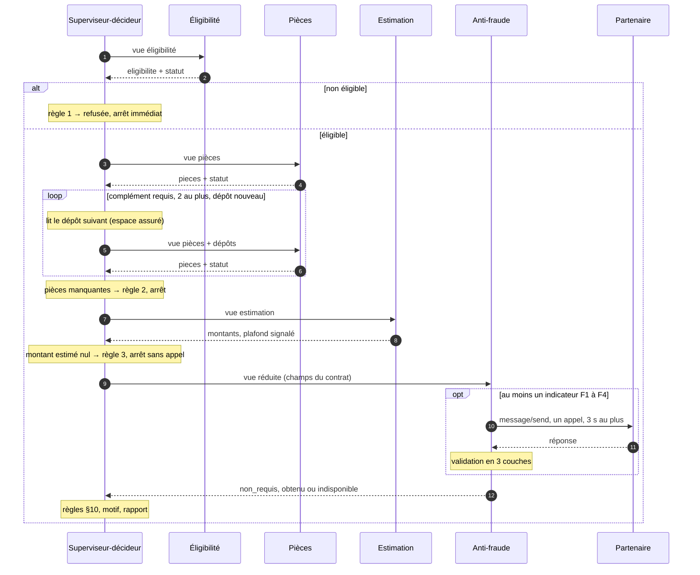

# 2 · Orchestration et mémoire partagée

[← Sommaire](README.md)

## Déroulé d'une demande

Le superviseur-décideur suit un **ordre fixe**, écrit dans le code ([superviseur.py:114-129](../../src/kaldera/superviseur.py#L114-L129)). Les règles de décision du [§10](../specs_metier.md#L180-L194) sont du code déterministe, appelé comme un outil ([decision.py](../../src/kaldera/decision.py)).

Après chaque agent, le superviseur contrôle la **forme** de la sortie, l'enregistre au nom de l'agent, puis fait la **revue de fond** facultative (voir plus bas).



## Conditions d'arrêt

Chaque chemin se termine par une issue, ce qui couvre E1.

| Situation | Issue | `arret` |
|---|---|---|
| Une règle du §10 s'applique | Décision ou escalade, selon la règle | `null` |
| Un agent renvoie `indetermine` | Escalade `gestionnaire`, avec le motif de l'agent | `null` |
| Une borne est atteinte (`complements_max`, `depot_identique`, `etapes_max`, `duree_max_s`) | Escalade `gestionnaire`, motif « Traitement interrompu : borne … atteinte » | `{ "borne": "<nom>", "detail": "…" }` |
| Erreur imprévue ou sortie d'agent non conforme (filet de sécurité) | Escalade `gestionnaire`, motif « Incident pendant le traitement automatisé » | `{ "borne": "incident", "detail": "<type d'erreur>" }` |

Une escalade par interruption ne porte pas de numéro de règle (`regle: null`). Code : [superviseur.py:81-112](../../src/kaldera/superviseur.py#L81-L112).

## Bornes

Ces valeurs ont été fixées **a priori** ([bornes.py](../../src/kaldera/bornes.py)). L'épreuve (livrable 4) les a confirmées sans changement ; chaque décision est consignée au [journal](../journal-ajustements.md).

| Borne | Valeur | Justification |
|---|---|---|
| `complements_max` | 2 | NOM-07 a besoin d'un complément ; un second laisse une deuxième chance à l'assuré |
| `depot_identique` | arrêt immédiat | L'espace assuré re-soumet le même dépôt quand l'assuré n'a rien de neuf ([espace_assure.py:4-6](../../src/kaldera/espace_assure.py#L4-L6)). BCL-01 s'arrête dès le premier tour. |
| `etapes_max` | 12 | Parcours le plus long : éligibilité 1 + pièces 1 + 2 compléments × 2 étapes + estimation 1 + anti-fraude 1 + issue 1 = 9 étapes, plus une marge de 3 |
| `duree_max_s` | 8 | Abandon de l'appel au partenaire à 3 s ([contrat §5](../../external_agent/contrat.md#L161-L165)), agents en quelques millisecondes ; marge sous les 10 s du [§12](../specs_metier.md#L213) |
| `delai_partenaire_s` | 3 | Imposé par le contrat |
| `disjoncteur_echecs` | 2 par lot | Sans effet sur PAN-01 : les deux appels partent en parallèle, avant le premier échec. Limite consignée ([journal](../journal-ajustements.md), entrée 7) |

`bornes()` expose ces valeurs, comme l'exige [interface.md:46-56](../interface.md#L46-L56).

## La mémoire partagée

Un **état centralisé par demande**, en mémoire, écrit par un seul acteur : le superviseur ([etat.py](../../src/kaldera/etat.py)).

```
État d'une demande
├── demande        lecture seule : une copie du JSON reçu
├── eligibilite    auteur : Éligibilité   · eligible + motifs
├── pieces         auteur : Pièces        · conformes, à redemander, factures ; une version par complément
├── estimation     auteur : Estimation    · montants + plafond_applique
├── avis_fraude    auteur : Anti-fraude   · non_requis | obtenu (niveau, score, evaluation_id) | indisponible (couche et raison du rejet)
├── issue          auteur : Superviseur   · la fiche de décision du §11, avec le numéro de règle
└── execution      superviseur, non métier · trace, horloge, arret
```

| Règle d'accès | Mise en œuvre |
|---|---|
| Les agents n'ont aucun droit d'écriture | Ils reçoivent une vue en lecture seule et renvoient leur résultat |
| Un seul auteur par section | Le superviseur vérifie qu'un agent ne renvoie que **sa** section, puis l'enregistre au nom de cet agent |
| Une section définitive ne change plus | Seule `pieces` connaît plusieurs versions, une par complément, toutes du même auteur |
| Moindre privilège en lecture | Une vue par agent (livrable 1) |

**La trace.** Une entrée par étape : `agent`, `action`, `ecrit`, `duree_ms`, `statut`. Une étape d'agent porte aussi `echec`, `appels_externes` et, si la revue de fond est active, `revue`. Le superviseur a deux étapes à lui : `demander_complement` (`ecrit: []`, avec les types demandés et le nombre de dépôts nouveaux) et `conclure` (`ecrit: ["issue"]`, avec le numéro de `regle`). Une borne atteinte n'ajoute pas d'étape : elle remplit `arret`, puis le superviseur conclut.

**L'historique neutralisé** ([historique.py](../../src/kaldera/historique.py)). Désactivé par défaut. Si `KALDERA_HISTORIQUE` donne le chemin d'un fichier, chaque demande traitée (par `traiter_demande` comme par `traiter_lot`) y ajoute une ligne JSON :

- **liste blanche** : horodatage, référence, client pseudonymisé, champs de la fiche (`issue`, `decision`, `montant_rembourse`, `file`, `motif`, `mode_degrade`, `regle`, `avis_fraude`, `arret`, `rapport`) et trace réduite (`agent`, `action`, `ecrit`, `statut`, `duree_ms`, `regle`, `revue`) ;
- **`id_client` pseudonymisé** par HMAC-SHA256 avec la clé `KALDERA_CLE_HMAC`, tronqué à 16 caractères. Sans clé, le champ `client` vaut `null` : ni identifiant en clair, ni hachage sans clé ;
- **jamais stockés** : nom, coordonnées, IBAN, adresse, numéro de contrat, description libre, pièces, ni le rapport destiné à l'assuré ;
- une erreur d'écriture est journalisée puis ignorée : l'historique ne bloque jamais une demande.

## La revue de fond, facultative

Le superviseur contrôle toujours la **forme** des sorties. La **revue de fond** ([revue.py](../../src/kaldera/revue.py)) examine en plus chaque section produite. C'est **un signal, jamais une correction** : en cas de désaccord, le sous-agent a raison. Aucune valeur n'est modifiée et l'issue ne change pas.

| Variable `KALDERA_REVUE` | Réviseur | Délai par examen |
|---|---|---|
| `regles` (défaut, et toute valeur vide ou inconnue) | Contrôles de cohérence déterministes, sans modèle : somme des factures, montant retenu, plafond signalé, niveau cohérent avec le score… | 0,5 s |
| `aucune` | Pas de revue | — |
| `llm` | Le modèle de langage de [llm.py](../../src/kaldera/llm.py) (Kimi-K2.6 sur Azure AI). Il ne reçoit que la section examinée, réduite à une liste blanche. | 2 s |
| `system_one` | Point d'extension en **hypothèse** : modèle de décision à sorties typées et confiance calibrée (livrable 6). Aucun service réel n'est branché. | 1 s |

Garanties, quel que soit le réviseur ([revue.py:96-122](../../src/kaldera/revue.py#L96-L122)) :

- le réviseur travaille sur une **copie** ; aucune exception ne remonte ;
- l'examen dure au plus le délai du réviseur, et jamais plus que le temps libre : `duree_max_s` − `delai_partenaire_s` − 1 s de marge − temps écoulé. La revue ne peut donc pas déclencher de borne ;
- résultat : `conforme`, `anomalie`, `indetermine` ou `indisponible`, noté dans l'étape de trace (`revue`), compté dans les métriques (`anomalies`) et repris dans le rapport gestionnaire.

**Le LLM n'intervient que dans la revue `llm`.** Le motif et le rapport sont rédigés par des gabarits déterministes. La rédaction par un LLM, prévue dans la conception initiale, **n'a pas été implémentée**. Les tests passent sans aucun modèle.
