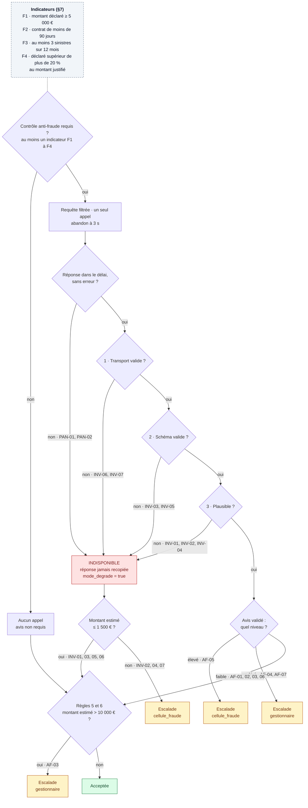

# 3 · Liaison A2A et mode dégradé

[← Sommaire](README.md)

## Le contrat v2.0 en bref

| Sujet | Règle | Source |
|---|---|---|
| Accès | JSON-RPC 2.0, `POST /a2a`, méthode `message/send`, jeton Bearer | [contrat §1](../../external_agent/contrat.md#L21-L28) |
| Données envoyées | Exactement 7 champs, tous obligatoires, aucun autre | [contrat §2](../../external_agent/contrat.md#L64-L76) |
| Données interdites | Identité, coordonnées, code postal complet, IBAN, identifiant client, numéro de contrat, description libre, pièces | [contrat §2](../../external_agent/contrat.md#L78-L89) |
| Réponse | Tâche A2A `completed` ; artefact avec `reference_dossier`, `score`, `niveau`, `indicateurs`, `evaluation_id`, `version_modele` | [contrat §3](../../external_agent/contrat.md#L91-L137) |
| Cohérence | `faible` si score < 0,40 ; `modere` de 0,40 à 0,75 ; `eleve` au-delà ; même `id`, aucun champ en trop | [contrat §3](../../external_agent/contrat.md#L139-L147) |
| Délai | Le partenaire répond en 2 s ; le client abandonne à **3 s** au plus | [contrat §5](../../external_agent/contrat.md#L161-L165) |
| Limites | **Un seul appel par dossier**, aucune relance ; un doublon est refusé (`-32029`) et signalé | [contrat §6](../../external_agent/contrat.md#L167-L173) |

## Le filtre des données sortantes (E3)

Deux barrières successives :
1. **La vue de l'agent Anti-fraude** ne contient que les 7 champs du contrat, plus le montant justifié qui sert au calcul de F4 et ne part jamais.
2. **L'adaptateur A2A construit le message champ par champ** à partir d'une liste blanche. Un champ ajouté plus tard à la demande ne peut donc pas partir par accident.

| Champ envoyé | Calcul |
|---|---|
| `reference_dossier`, `type_sinistre`, `montant_declare`, `date_survenance`, `sinistres_12_mois` | Copiés de la demande |
| `anciennete_contrat_jours` | Jours entre la souscription et la survenance (la date de souscription, elle, ne part pas) |
| `departement` | Les 2 premiers caractères du code postal, **avec deux cas limites** : la Corse (20000-20199 → `2A`, 20200-20699 → `2B`) et l'outre-mer (97xxx et 98xxx → 3 chiffres) |

## L'appel

- **Un seul appel par dossier.** Un registre des références déjà évaluées empêche un second appel **dans un même lot** ([partenaire.py:68-99](../../src/kaldera/partenaire.py#L68-L99)). Le registre est **limité au lot** : un client A2A est créé par lot (ou par demande pour `traiter_demande`). Si un même dossier revient dans un lot suivant, le partenaire refuse le doublon (`-32029`) : l'avis est indisponible, le mode dégradé s'applique, et rien n'est relancé. Un registre global a été écarté ([journal](../journal-ajustements.md), « Ajustements écartés »).
- **Abandon à 3 s**, pris sur le budget de la demande (`duree_max_s` = 8) : le délai réel est `min(3 s, duree_max_s − temps écoulé − 0,5 s)`, avec un minimum de 0,1 s.
- **Aucune relance**, ni après un délai dépassé, ni après une erreur, ni après une réponse rejetée.
- **Le jeton** est lu dans `PARTENAIRE_JETON` et n'apparaît jamais dans la trace.

## Valider la réponse avant d'y croire (E4)

| Couche | Ce qu'on vérifie | Scénarios arrêtés |
|---|---|---|
| 1 · Transport | Code HTTP 200, corps JSON, enveloppe JSON-RPC 2.0 valide, même `id` que la requête, aucune erreur JSON-RPC (dont le doublon `-32029`) | INV-06, INV-07 |
| 2 · Schéma | Tâche `completed`, une seule partie `data`, champs exacts et bien typés, aucun champ en trop | INV-03, INV-05 |
| 3 · Plausibilité | Score entre 0 et 1, niveau cohérent avec le score, même `reference_dossier` que la demande | INV-01, INV-02, INV-04 |

La première couche qui échoue rend l'avis **indisponible**. La réponse n'est jamais recopiée dans la fiche ([§7, L143-145](../specs_metier.md#L143-L145)). Si elle est valide, on conserve `niveau`, `score` et `evaluation_id` (pour l'audit). Code : [partenaire.py:139-196](../../src/kaldera/partenaire.py#L139-L196). Avant ces trois couches, un délai dépassé, un service injoignable ou une réponse HTTP 5xx sont classés comme **panne**.

## Arbre de décision anti-fraude et mode dégradé

Toutes les feuilles ont été vérifiées par rapport aux issues attendues dans [scenarios.jsonl](../../eval/scenarios.jsonl).

## Ne bloquer personne

- **Les demandes d'un lot sont traitées en parallèle** (8 au plus en même temps), chacune avec son budget de temps.
- **Disjoncteur par lot** : après 2 pannes du partenaire dans un même lot (délai dépassé, service injoignable ou HTTP 5xx ; une réponse rejetée par la validation ne compte pas), on ne l'appelle plus. Les demandes suivantes passent directement en avis indisponible, donc en mode dégradé. Avec le registre anti-doublon, c'est le seul état partagé entre les demandes d'un lot.
- **Limite connue** : les demandes partent en parallèle, donc les premiers appels partent avant le premier échec. Le disjoncteur ne protège qu'au-delà.

## Sécurité : un partenaire menteur

Le brief prévient : le partenaire peut être « lent, menteur ou en panne ».

| Menace | Exemple | Parade |
|---|---|---|
| Réponse qui cherche à dicter la décision | INV-03 ajoute `decision_recommandee: "rembourser_integralement"` et un commentaire rassurant | Le schéma strict rejette tout champ en trop. Seuls des champs typés et validés sont conservés. |
| Injection de prompt vers le LLM | Le même texte, s'il était lu par un LLM | Le seul LLM possible, celui de la revue `llm`, ne reçoit que la section examinée réduite à sa liste blanche (statut, indicateurs, niveau et score validés pour l'avis). Il ne voit **jamais** la réponse brute du partenaire, ni la description libre de l'assuré |
| Fuite de données personnelles | Le code fourni envoyait toute la demande | Liste blanche, vue réduite, test des valeurs personnelles dans le corps envoyé |
| Doublon d'appel signalé au partenaire | Une demande soumise deux fois | Registre des références évaluées, limité au lot. Entre deux lots, le partenaire refuse (`-32029`) : avis indisponible, mode dégradé, aucune relance |

## Notre partenaire anti-fraude et son déploiement

Pour éprouver la liaison contre un vrai service, et pas seulement contre le simulateur fourni, nous avons écrit **notre propre partenaire** ([partenaire_antifraude/app.py](../../partenaire_antifraude/app.py)), conforme au contrat v2.0.

| Sujet | Mise en œuvre |
|---|---|
| Routes | Agent Card (`/.well-known/agent.json`), `POST /a2a` (`message/send`) et `GET /health`, proposé en v2.1. **Aucune route de simulation** `/_sim/*` |
| Jeton | Lu dans `PARTENAIRE_JETON` ; absent ou invalide → HTTP 401 |
| Schéma strict | Les 7 champs, tous obligatoires, aucun autre ; sinon `-32602`, avec le détail (champs inconnus, absents ou invalides) |
| Un appel par dossier | Registre des références évaluées, en mémoire ; un doublon → `-32029` |
| Score explicable | 0,06 de base, plus le poids de chaque indicateur relevé : `MONTANT_ELEVE` 0,22, `SINISTRE_PRECOCE` 0,18, `FREQUENCE_ELEVEE` 0,30, `TYPE_SENSIBLE` 0,12 ; plafonné à 0,97. Mêmes poids que le simulateur fourni. Le niveau suit les seuils du contrat |

**Déploiement, 9 octobre 2026.** Google Cloud, projet `project-dcb41d07-e852-4bf6-85f`, région `europe-west9` (Paris), images dans le dépôt Artifact Registry `kaldera`.

| Service Cloud Run | URL | Script |
|---|---|---|
| Partenaire anti-fraude | https://partenaire-antifraude-oesi5cx3mq-od.a.run.app | [deployer_partenaire.sh](../../scripts/deployer_partenaire.sh) |
| Console Kaldera, branchée sur ce partenaire | https://kaldera-console-oesi5cx3mq-od.a.run.app | [deployer_console.sh](../../scripts/deployer_console.sh) |

- Les images sont **construites en local avec Docker**, puis poussées dans Artifact Registry. `gcloud run deploy --source` échoue sur ce projet : le compte de service de Cloud Build n'a pas les droits nécessaires.
- Le partenaire tourne avec **`--max-instances 1`** ([deployer_partenaire.sh:33-37](../../scripts/deployer_partenaire.sh#L33-L37)) : son registre anti-doublon vit en mémoire. Deux instances auraient chacune leur registre, et un doublon pourrait passer.
- **Limite connue :** ce registre est perdu quand l'instance s'arrête (mise en veille Cloud Run, redéploiement). La production demanderait un registre persistant.
- Les deux services acceptent les appels non authentifiés au niveau de Cloud Run. `/a2a` reste protégé par le jeton. La console, elle, est ouverte : c'est un environnement de démonstration.
- Le jeton est passé en variable d'environnement du service. Il n'est écrit dans aucun fichier versionné.
- La console reconnaît un partenaire **réel** : il ne répond pas sur `/_sim/etat`, mais répond sur `/health` ou sur son Agent Card ([web.py:66-80](../../src/kaldera/web.py#L66-L80)). Face à lui, elle refuse de forcer une panne, une lenteur ou une réponse invalide (HTTP 409). Un second rejeu du même scénario déclenche le doublon `-32029`, donc le mode dégradé.

Les vérifications faites sur ces services sont dans [preuves-execution.md](../preuves-execution.md#environnement-google-cloud).

## Évolutions proposées du contrat (v2.1)

Le formateur autorise à faire évoluer le contrat. Ces propositions sont à négocier avec le partenaire ; aucune n'est nécessaire pour respecter la v2.0.

| Proposition | Bénéfice |
|---|---|
| **Clé d'idempotence** : un `messageId` stable par dossier, pour lequel le partenaire renvoie la même évaluation au lieu de `-32029` | Une relance après une coupure réseau devient sûre |
| **Point de santé** `GET /health` (déjà exposé par notre partenaire ; la console s'en sert pour le reconnaître) | Le disjoncteur peut se refermer sans consommer l'appel unique d'un dossier |
| **En-tête `Retry-After`** sur les réponses 503 | Le disjoncteur sait combien de temps rester ouvert |
| **Indicateurs du partenaire alignés sur F1 à F4** | Le rapport de décision devient plus lisible |
