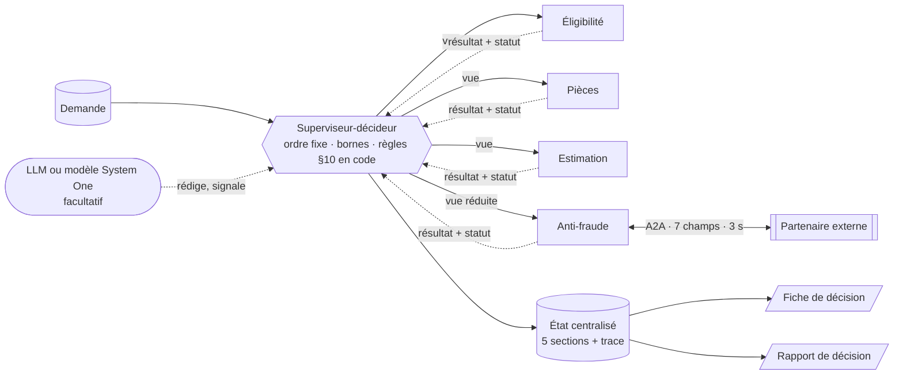

# Kaldera V2 : dossier de conception

**Version :** 8 octobre 2026, branche `integration-projet`. À valider par le formateur avant tout code.

## En une phrase

L'agent généraliste est remplacé par **une équipe de quatre spécialistes et un superviseur-décideur à ordre fixe**. Chaque demande finit par une décision ou une escalade motivée, **expliquée dans un rapport**, même quand le partenaire anti-fraude est lent, menteur ou en panne.

## Les livrables

| # | Livrable | Contenu |
|---|---|---|
| 1 | [Carte des agents](1-carte-des-agents.md) | Rôles, vues, frontières (dont le point ambigu tranché), dépendances, parallélisme |
| 2 | [Orchestration et mémoire partagée](2-orchestration-memoire.md) | Déroulé, conditions d'arrêt, bornes provisoires, état partagé, trace |
| 3 | [A2A et mode dégradé](3-a2a-mode-degrade.md) | Contrat, filtre des données, validation, arbre de décision, sécurité, évolutions du contrat |
| 4 | [Plan d'épreuve](4-plan-epreuve.md) | Scénarios × signaux × ajustements, règle d'ajustement, journal |
| + | [Rapport de décision](5-rapport-de-decision.md) | Un rapport qui motive et explique chaque décision |
| + | [Modèle de décision System One](6-modele-system-one.md) | Où un modèle comme Jev a sa place, et où il est exclu |

## Décisions clés

| Sujet | Décision | Raison |
|---|---|---|
| Équipe | 4 spécialistes + 1 superviseur-décideur | Un agent par section métier ([interface.md:41-44](../interface.md#L41-L44)) |
| Orchestration | Workflow codé à ordre fixe, arrêt dès qu'une règle conclut | Terminaison garantie (E1), aucun appel inutile au partenaire (E3) |
| Règles §10 | Code déterministe ; le LLM est facultatif | Les tests passent sans LLM, montants exacts au centime |
| Point ambigu | Le plafond (§4) est appliqué par l'Estimation, signalé et rappelé dans le motif | NOM-05 attend 3 000 €, alors que le code actuel refuse la demande |
| État | Centralisé, un seul écrivain, auteur tracé, moindre privilège | E2 vérifiable par le code |
| Partenaire | 7 champs en liste blanche, 1 appel, abandon à 3 s, validation en 3 couches | Contrat v2.0 |
| Mode dégradé | §9 de la spec, plus un disjoncteur par lot | E5 |
| Bornes provisoires | 2 compléments maximum, arrêt si le dépôt est identique, `etapes_max` = 12, `duree_max_s` = 8 | À éprouver (livrable 4) |

## Point de départ : le code fourni

Le code fourni ([src/kaldera/](../../src/kaldera/)) enfreint chacune des six exigences. C'est notre « avant » ; le nombre de tests qui échouent sera mesuré avec `make test` avant tout développement.

| Défaut | Où | Exigence |
|---|---|---|
| Un seul agent écrit les 5 sections | [orchestrateur.py:35-38](../../src/kaldera/orchestrateur.py#L35-L38) | E2 |
| Toute la demande est envoyée au partenaire, IBAN compris | [partenaire.py:31](../../src/kaldera/partenaire.py#L31) | E3 |
| La réponse est recopiée sans validation | [partenaire.py:42](../../src/kaldera/partenaire.py#L42) | E4 |
| Appel sans délai maximal (`timeout=None`) | [partenaire.py:38](../../src/kaldera/partenaire.py#L38) | E1, E5 |
| Partenaire muet → fiche `en_attente` | [agent_generaliste.py:21](../../src/kaldera/agent_generaliste.py#L21), [L124](../../src/kaldera/agent_generaliste.py#L124) | E1 |
| Plafond traité comme un motif de refus | [agent_generaliste.py:70-71](../../src/kaldera/agent_generaliste.py#L70-L71) | Point ambigu |
| Boucle de compléments sans `arret` ; `MAX_TOURS = 50` | [orchestrateur.py:10](../../src/kaldera/orchestrateur.py#L10) | E6 |
| Ni `mode_degrade`, ni `bornes()`, ni métriques par agent | [__init__.py](../../src/kaldera/__init__.py) | E5, E6 |

**Note de vocabulaire :** la spec numérote aussi « E1 à E5 » ses conditions d'éligibilité (§4). Dans ce dossier, **E1 à E6 désignent toujours les exigences de la direction des opérations**. Les conditions d'éligibilité sont appelées « conditions 1 à 5 du §4 ».
